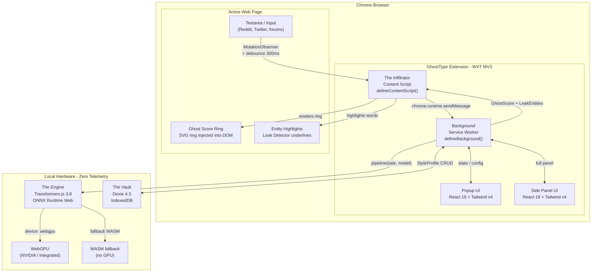
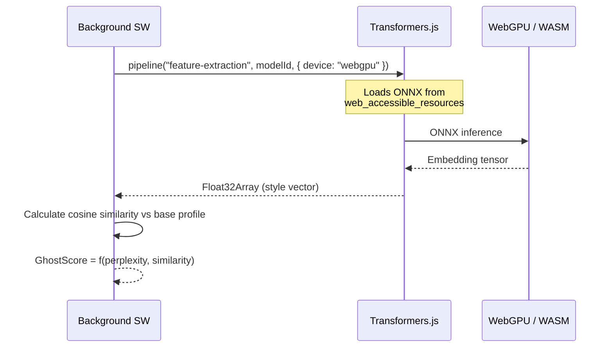

# GhostType Architecture

## Overview

GhostType is a **local-first** browser extension built on Manifest V3 (MV3). All analysis, inference, and storage logic runs on the user's device. There is no backend server, no telemetry endpoint, and no remote model.

The architecture is organized into three main components with clearly defined responsibilities:

| Component | Internal Name | Technology | Responsibility |
|---|---|---|---|
| Content Script | **The Infiltrator** | WXT + DOM API | Observe text, inject UI into the page |
| Inference Engine | **The Engine** | Transformers.js + WebGPU | Run ONNX models locally |
| Local Storage | **The Vault** | Dexie.js + IndexedDB | Persist encrypted stylistic profiles |

---

## Component Diagram



---

## Detailed Data Flow

### 1. Text Capture (The Infiltrator)

The content script observes the active page DOM using a `MutationObserver`. When it detects changes in a `<textarea>` or `contenteditable` element:

1. Applies a **300ms debounce** to avoid flooding the background on every keystroke.
2. Extracts plain text from the element.
3. Sends the text to the Service Worker via `chrome.runtime.sendMessage`.

```
Textarea keystroke → MutationObserver → debounce 300ms → sendMessage(text)
```

### 2. Analysis in the Service Worker (Background)

The Service Worker acts as the central orchestrator. Upon receiving a message with text:

1. Calls **The Engine** to obtain embeddings and classifications.
2. Queries **The Vault** to compare against the user's previous stylistic profile.
3. Calculates the **Ghost Score** (0–100) based on stylistic perplexity.
4. Runs the **Leak Detector** to identify critical entities.
5. Returns the result to the content script.

### 3. Local Inference (The Engine)



### 4. Persistence (The Vault)

The Vault stores the user's **stylistic profile**: a collection of embedding vectors from previous texts. This profile never leaves the device.

```
New text → embedding → compare with profile → update profile → persist in IndexedDB
```

---

## Detailed Tech Stack

### WXT `0.20.18` — Extension Framework

WXT is the core framework of the project. It replaces CRXJS (stalled development) and manages:

- **File-based entrypoints**: the `src/entrypoints/` directory structure automatically defines what is included in the generated `manifest.json`.
- **True HMR** for content scripts and background in development.
- **Native Vite 5-7 support**, compatible with all ecosystem plugins.
- **Auto-generated manifest** from the configuration in `wxt.config.ts`.

```typescript
// wxt.config.ts — manifest.json is generated from here
export default defineConfig({
  srcDir: 'src',
  modules: ['@wxt-dev/module-react'],
  manifest: {
    permissions: ['activeTab', 'storage', 'sidePanel'],
  },
});
```

**Why WXT and not CRXJS:**
- CRXJS has had no active updates since 2023.
- WXT has 9.3k stars on GitHub and 173k weekly downloads on npm.
- WXT supports MV2 and MV3, Chrome, Firefox, Edge, and Safari from a single codebase.

---

### Transformers.js `3.8.1` — The Engine

Transformers.js runs ONNX models directly in the browser, without a server. It is the central piece of the stylometric analysis.

**WebGPU configuration:**
```typescript
import { pipeline } from '@huggingface/transformers';

const extractor = await pipeline(
  'feature-extraction',
  'Xenova/all-MiniLM-L6-v2',
  { device: 'webgpu' }  // automatic fallback to WASM if no WebGPU
);
```

**Planned models:**

| Model | Task | Size | Usage |
|---|---|---|---|
| `Xenova/all-MiniLM-L6-v2` | Feature extraction | ~23MB | Stylistic embeddings |
| `Xenova/bert-base-NER` | Token classification | ~64MB | Entity detection (Leak Detector) |
| Custom SLM (Phase 3) | Text generation | ~100-300MB | Adversarial Rewriting |

**Critical MV3 restriction (CSP):**

Manifest V3 blocks dynamic loading of external scripts. WASM and ONNX files must be bundled with the extension and declared as `web_accessible_resources`. Path configuration in the background:

```typescript
import { env } from '@huggingface/transformers';

env.backends.onnx.wasm.wasmPaths = chrome.runtime.getURL('transformers/');
```

**Why v3 and not v4:**
- Transformers.js v4 is in preview (`@next` on npm), not a stable release.
- v3.8.1 already has full WebGPU support with `device: 'webgpu'`.

---

### Dexie.js `4.3.0` — The Vault

Dexie is the IndexedDB wrapper that manages local storage of stylistic profiles.

**Database schema:**

```typescript
import Dexie, { Table } from 'dexie';

interface StyleProfile {
  id?: number;
  sessionId: string;
  embeddings: Float32Array[];
  createdAt: Date;
  updatedAt: Date;
}

interface TextSample {
  id?: number;
  hash: string;       // text hash for deduplication
  embedding: number[];
  timestamp: Date;
}

class GhostVault extends Dexie {
  profiles!: Table<StyleProfile>;
  samples!: Table<TextSample>;

  constructor() {
    super('ghosttype-vault');
    this.version(1).stores({
      profiles: '++id, sessionId, updatedAt',
      samples: '++id, hash, timestamp',
    });
  }
}
```

**Why Dexie v4:**
- Native TypeScript API with full type inference.
- Support for complex transactions and reactive queries.
- Widely adopted (100k+ websites).

---

### React `19.2.4` + Tailwind CSS `4.2.1`

The popup and side panel UI uses React 19 with the new Tailwind v4 system.

**Tailwind v4 — Key changes:**

Tailwind v4 removes the `tailwind.config.ts` and `postcss.config.js` files. Configuration is **CSS-first**:

```css
/* src/assets/styles/global.css */
@import "tailwindcss";

/* Custom design tokens */
@theme {
  --color-ghost: oklch(0.7 0.15 200);
  --color-danger: oklch(0.65 0.2 25);
}
```

Integrated as a direct Vite plugin (no PostCSS):

```typescript
// wxt.config.ts
import tailwindcss from '@tailwindcss/vite';

export default defineConfig({
  vite: () => ({
    plugins: [tailwindcss()],
  }),
});
```

**Known limitation:** Tailwind v4 has issues with shadow roots, which is relevant for UI injected by the content script. The Ghost Score Ring UI and Leak Detector highlights will be implemented with vanilla CSS or a manual shadow DOM to avoid conflicts.

---

## Security Model — Zero Telemetry

GhostType upholds a total privacy promise:

| Principle | Implementation |
|---|---|
| No network | No `fetch()` or `XMLHttpRequest` to external domains in production |
| No analytics | No telemetry SDKs included (GA, Sentry, Mixpanel, etc.) |
| No remote models | ONNX models are bundled with the extension or downloaded once to IndexedDB |
| No remote logs | All errors are logged only to local `console` |
| Encrypted data | Stylistic profiles in IndexedDB are stored with AES-GCM encryption via Web Crypto API |

**Manifest permissions (minimum required):**

```json
{
  "permissions": ["activeTab", "storage", "sidePanel"],
  "host_permissions": []
}
```

No global `host_permissions` are requested. The content script only activates on the active tab.

---

## Directory Structure

```
ghosttype/
  src/
    entrypoints/              # WXT file-based entrypoints
      background.ts           # Service Worker (defineBackground)
      content.ts              # Content Script (defineContentScript)
      popup/                  # Popup UI
        index.html
        main.tsx
        App.tsx
        style.css
      sidepanel/              # Side Panel UI
        index.html
        main.tsx
        App.tsx
        style.css
    components/               # Shared React components
      ui/                     # GhostScoreRing, LeakBadge, etc.
    engine/                   # The Engine
      index.ts                # Engine public API
      models.ts               # ONNX model configuration
    vault/                    # The Vault
      index.ts                # Vault public API
      schema.ts               # Dexie schema
    modules/                  # Pure business logic
      ghostScore.ts           # Ghost Score calculation
      leakDetector.ts         # Critical entity detection
    utils/                    # Shared utilities
    types/                    # Global TypeScript types
      index.ts
  assets/
    styles/
      global.css              # @import "tailwindcss" + @theme tokens
  public/
    icons/                    # Icons 16x16, 48x48, 128x128
  docs/
    ARCHITECTURE.md           # This document
    ROADMAP.md
  wxt.config.ts
  package.json
  tsconfig.json
  .gitignore
  README.md
  LICENSE
```

---

## Design Decisions

### Why a Service Worker as the orchestrator?

In MV3, the background is an ephemeral (non-persistent) Service Worker. All heavy inference logic lives here because:

1. The content script has limited access to browser APIs.
2. The Service Worker can load and cache ONNX models between invocations.
3. Centralizing the logic makes unit testing easier.

### Why not use a Web Worker for inference?

Transformers.js supports Web Workers, but in the context of an MV3 extension, the Service Worker already acts as a worker separate from the content script. Adding another layer of workers would increase complexity without real benefit in this case.

### Why Dexie and not chrome.storage?

`chrome.storage.local` has a default limit of ~5MB. The embedding vectors of a stylistic profile can exceed that limit over time. IndexedDB has no practical limit for this use case.
