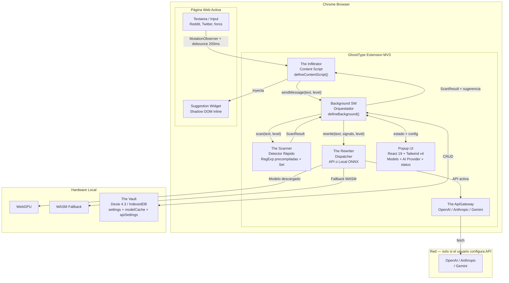
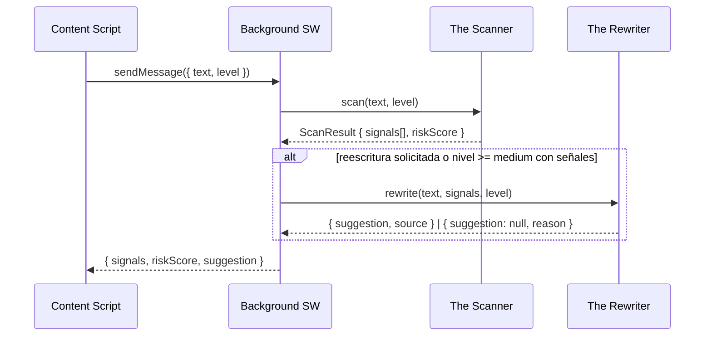
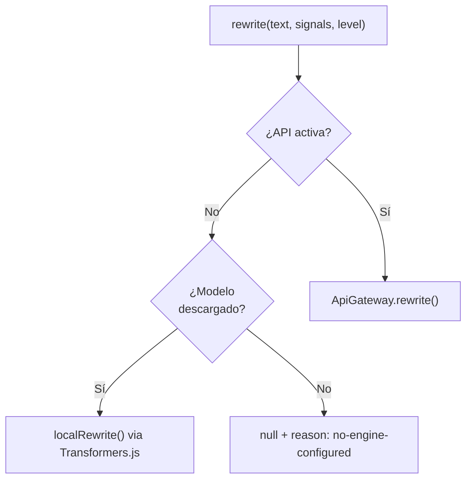

# GhostType — Arquitectura

## Overview

GhostType es una extensión de navegador **local-first** construida sobre Manifest V3 (MV3). Su propósito central es reescribir mensajes del usuario para eliminar información sensible, personal o rastreable antes de publicarlos en línea, preservando al máximo el sentido y el tono del mensaje original.

**Principios de diseño:**

- Todo el procesamiento ocurre en el dispositivo del usuario. Ningún texto sale del navegador salvo que el usuario configure explícitamente una API externa.
- La extensión debe ser rápida: detectar señales mientras el usuario escribe, reescribir bajo demanda.
- El motor de reescritura es completamente controlado por el usuario: elige qué modelo local descargar o qué API externa usar; nada se descarga ni envía sin su confirmación explícita.
- La persistencia se minimiza: solo se guardan configuraciones, el modelo cacheado y API keys ofuscadas. Nunca el contenido original.

---

## Componentes Principales


| Componente     | Nombre Interno      | Tecnología                       | Responsabilidad                                            |
| -------------- | ------------------- | -------------------------------- | ---------------------------------------------------------- |
| Content Script | **The Infiltrator** | WXT + DOM API                    | Observar texto, inyectar UI de sugerencias en la página    |
| Orquestador    | **Background SW**   | WXT Service Worker               | Coordinar el pipeline, gestionar ciclo de vida             |
| Detector       | **The Scanner**     | RegExp precompiladas + Set       | Identificar señales de riesgo sin modelo de IA             |
| Dispatcher     | **The Rewriter**    | TypeScript puro                  | Elegir entre ApiGateway o Local ONNX y devolver sugerencia |
| API externa    | **The ApiGateway**  | fetch + adapters                 | Llamar a OpenAI / Anthropic / Gemini con prompt unificado  |
| Almacenamiento | **The Vault**       | Dexie.js + IndexedDB + WebCrypto | Settings, caché del modelo y API keys ofuscadas            |


---

## Diagrama de Componentes




---

## Flujo de Datos Detallado

### 1. Captura de texto (The Infiltrator)

El content script observa el DOM activo con un `MutationObserver`. Al detectar cambios en un `<textarea>` o elemento `contenteditable`:

1. Aplica un **debounce de 200ms** para no saturar el Service Worker en cada pulsación.
2. Extrae el texto plano del elemento.
3. Envía el texto al Service Worker con el nivel de privacidad actual: `{ text, level: 'soft' | 'medium' | 'strong' }`.

```
Escritura → MutationObserver → debounce 200ms → sendMessage({ text, level })
```

### 2. Pipeline de análisis (Background SW)

El Service Worker actúa como orquestador. Al recibir un mensaje:

1. Pasa el texto a **The Scanner** (detección instantánea, sin modelo).
2. Si el nivel lo requiere o el usuario solicita reescritura, invoca **The Rewriter**.
3. Devuelve al content script el resultado: señales detectadas + sugerencia de texto reescrito (o `null` si no hay engine configurado).




### 3. Detección rápida (The Scanner)

The Scanner opera únicamente con reglas deterministas. Es la capa siempre disponible, incluso sin conexión y sin modelo cargado.

**Optimizaciones v2:**

- Todos los `RegExp` se compilan **una sola vez** al iniciar el Service Worker, no en cada llamada.
- Los diccionarios grandes (ciudades, países, tecnologías, nombres) se almacenan como `Set<string>` para lookup O(1) en lugar de O(n) regex.
- Los patrones activos se filtran según el nivel antes de ejecutar: `soft` activa ~30% de patrones, `strong` activa el 100%.

Señales detectadas según el nivel activo:


| Señal                                  | Suave | Medio | Fuerte |
| -------------------------------------- | ----- | ----- | ------ |
| Nombre propio (persona)                | ✓     | ✓     | ✓      |
| Email / teléfono / URL personal        | ✓     | ✓     | ✓      |
| Ciudad o país explícito                | —     | ✓     | ✓      |
| Profesión o título académico           | —     | ✓     | ✓      |
| Tecnologías y herramientas específicas | —     | ✓     | ✓      |
| Expresiones temporales concretas       | —     | ✓     | ✓      |
| Dialectos, modismos regionales         | —     | —     | ✓      |
| Patrones de escritura individualizados | —     | —     | ✓      |


El Scanner devuelve un `ScanResult` con las señales encontradas y un `riskScore` (0–100) estimado por reglas.

### 4. Dispatcher de reescritura (The Rewriter)

The Rewriter no ejecuta inferencia directamente. Decide qué engine usar y delega:

```
¿Hay API configurada y activa?
  → Sí: ApiGateway.rewrite(cfg, text, level)
  → No: ¿Hay modelo local descargado y activo?
       → Sí: localRewrite(modelEntry, text, signals, level) vía Transformers.js
       → No: devuelve { suggestion: null, reason: 'no-engine-configured' }
```

Reglas del dispatcher:

- **Nunca** descarga modelos automáticamente. Si no hay ningún engine disponible, devuelve `null` y el widget muestra un CTA para configurar.
- Timeout duro de **8 segundos** para cualquier inferencia (API o local). Si se supera, devuelve `{ suggestion: null, reason: 'timeout' }`.
- Al devolver `null`, el widget sigue mostrando las señales detectadas por el Scanner; la reescritura simplemente no está disponible.




### 5. API Gateway (The ApiGateway)

The ApiGateway hace la llamada a la API externa elegida por el usuario usando el mismo system prompt para todos los proveedores. La API key se descifra in-memory justo antes de la llamada y nunca se persiste en claro.

**System prompt unificado (`PRIVACY_REWRITE_PROMPT`):**

```typescript
const PRIVACY_REWRITE_PROMPT = `
You are a privacy assistant inside a browser extension.
Rewrite the user's text to remove or generalize PII while preserving meaning and tone.

Rules:
- Replace personal names → generic alternatives ("someone", "a person", "they")
- Generalize locations → ("a European city", "my country", "somewhere nearby")
- Remove specific dates → keep rough timeframes ("recently", "a few years ago")
- Replace specific tools/tech → categories ("a JS framework", "a cloud provider")
- Do NOT add opinions or new information
- Output ONLY the rewritten text, no preface, no quotes

Privacy level: {level}
- soft: only direct identifiers (names, emails, phones)
- medium: also location, profession, specific tools
- strong: maximize anonymity, remove all potentially identifying context
`;
```

Proveedores y modelos por defecto:


| Proveedor     | Modelo por defecto | Latencia típica |
| ------------- | ------------------ | --------------- |
| OpenAI        | `gpt-4o-mini`      | < 1.5s          |
| Anthropic     | `claude-haiku-3-5` | < 1.5s          |
| Google Gemini | `gemini-2.0-flash` | < 1.5s          |


### 6. Catálogo de modelos locales

El usuario elige un modelo del catálogo y lo descarga manualmente desde el popup. Solo puede activarse un modelo ya descargado.


| id                | Label                        | Repo                        | Tamaño | Latencia WebGPU | Latencia WASM | Calidad |
| ----------------- | ---------------------------- | --------------------------- | ------ | --------------- | ------------- | ------- |
| `t5-small-q8`     | T5 Small (rápido)            | `Xenova/t5-small`           | ~30MB  | < 800ms         | < 2s          | básica  |
| `lamini-77m-q8`   | LaMini-Flan-T5 77M (balance) | `Xenova/LaMini-Flan-T5-77M` | ~80MB  | < 1.5s          | < 4s          | media   |
| `flan-t5-base-q8` | FLAN-T5 Base (calidad)       | `Xenova/flan-t5-base`       | ~120MB | < 3s            | < 8s          | alta    |


> Las cifras de latencia son orientativas. Se confirmarán con benchmarks reales en Fase 2 sobre hardware variado. El timeout duro de 8s se aplica a todos los modelos en WASM; el usuario puede elegir según su hardware.

### 7. UI de sugerencias (Suggestion Widget)

El content script inyecta un widget flotante junto al textarea activo implementado con **DOM vanilla + Shadow DOM** (sin React en el content script, para evitar colisiones con versiones de React ya presentes en la página):

- Badge de riesgo (verde / amarillo / rojo) con el `riskScore`.
- Chips de las señales detectadas por The Scanner.
- Sección de sugerencia reescrita si hay engine disponible.
- Botón "Aplicar" que reemplaza el texto del textarea con la sugerencia.
- Botón "Ignorar" que descarta la sugerencia.
- Indicador de carga mientras The Rewriter procesa.
- CTA "Configurar engine" si el Rewriter devuelve `no-engine-configured`.
- UI minimalista ultra simple no saturar al usario, centrado en funcionalidad

---

## Niveles de Privacidad

Configurables desde el popup y persistidos en The Vault.

### Suave (`soft`)

- El Scanner detecta solo señales de alto riesgo directas: nombres propios, emails, teléfonos, URLs personales.
- The Rewriter solo se activa si el usuario lo solicita manualmente.
- Latencia percibida del Scanner: < 15ms.

### Medio (`medium`) — por defecto

- El Scanner detecta ubicaciones, profesiones, tecnologías y temporalidad.
- The Rewriter se activa al detectar ≥ 2 señales o al solicitarlo el usuario.
- El texto reescrito intenta mantener el tono y sentido original.

### Fuerte (`strong`)

- El Scanner activa todos los patrones disponibles incluyendo dialectos y modismos.
- The Rewriter se activa con cualquier señal detectada.
- Se aceptan más cambios en el texto para maximizar el anonimato.

---

## Stack Técnico

### WXT `0.20.18` — Framework de extensiones

WXT gestiona entrypoints, HMR y el manifest MV3 generado automáticamente.

```typescript
// wxt.config.ts
export default defineConfig({
  srcDir: 'src',
  modules: ['@wxt-dev/module-react'],
  manifest: {
    permissions: ['activeTab', 'storage', 'sidePanel'],
    web_accessible_resources: [
      { resources: ['transformers/*'], matches: ['<all_urls>'] },
    ],
  },
  vite: () => ({
    plugins: [tailwindcss()],
    optimizeDeps: { exclude: ['@huggingface/transformers'] },
  }),
});
```

### Transformers.js `3.8.1` — Motor de inferencia local

Ejecuta los modelos ONNX del catálogo directamente en el navegador vía WebGPU o WASM.

```typescript
// src/engine/rewriter.ts — carga lazy del modelo activo
import { pipeline, env } from '@huggingface/transformers';

env.backends.onnx.wasm.wasmPaths = chrome.runtime.getURL('transformers/');

async function localRewrite(modelEntry: ModelEntry, text: string, level: PrivacyLevel) {
  const pipe = await pipeline('text2text-generation', modelEntry.repo, {
    device: 'webgpu', // fallback automático a WASM
    dtype: 'q8',
  });
  const result = await pipe(buildPrompt(text, level), {
    max_new_tokens: Math.min(text.length * 2, 512),
    num_beams: 1,
  });
  return result[0].generated_text;
}
```

Los archivos ONNX/WASM se declaran como `web_accessible_resources` para cumplir con la CSP de MV3.

### Dexie.js `4.3.0` — The Vault

```typescript
// src/vault/schema.ts
class GhostVault extends Dexie {
  settings!: Table<AppSettings>;
  modelCache!: Table<ModelCacheEntry>;
  apiSettings!: Table<ApiSettingsRow>;

  constructor() {
    super('ghosttype-vault');
    this.version(1).stores({
      settings: '&key',
      modelCache: '&modelId, cachedAt, sizeMB',
      apiSettings: '&provider',
    });
  }
}
```

The Vault almacena únicamente:

- `settings`: toggle on/off, nivel activo, modelo activo, proveedor API activo.
- `modelCache`: blobs ONNX descargados por el usuario.
- `apiSettings`: API keys ofuscadas con AES-GCM (ver sección de seguridad).

Nunca almacena el texto original del usuario.

### React `19.2.4` + Tailwind CSS `4.2.1`

El popup usa React 19. El Suggestion Widget del content script usa DOM vanilla + Shadow DOM para aislamiento total de la página host.

---

## Encriptación de API Keys

Las API keys se ofuscan en IndexedDB con **WebCrypto AES-GCM**. La master key se deriva de `chrome.runtime.id` con PBKDF2.

```typescript
// src/vault/crypto.ts
async function getMasterKey(): Promise<CryptoKey> {
  const seed = chrome.runtime.id + '|ghosttype-v1';
  const salt = new TextEncoder().encode('gt-salt-v1');
  const baseKey = await crypto.subtle.importKey(
    'raw',
    new TextEncoder().encode(seed),
    'PBKDF2',
    false,
    ['deriveKey'],
  );
  return crypto.subtle.deriveKey(
    { name: 'PBKDF2', salt, iterations: 100_000, hash: 'SHA-256' },
    baseKey,
    { name: 'AES-GCM', length: 256 },
    false,
    ['encrypt', 'decrypt'],
  );
}
```

> **Aviso de seguridad**: esto es **ofuscación**, no seguridad real. Cualquier código con acceso al perfil del navegador puede derivar la misma key y descifrar. Es inevitable en MV3: la extensión necesita la key en claro para llamar a la API. El objetivo es evitar leaks triviales por inspección directa de IndexedDB, no proteger contra un atacante con acceso al sistema de archivos del usuario.

---

## Modelo de Seguridad — Zero Telemetry


| Principio              | Implementación                                                                                              |
| ---------------------- | ----------------------------------------------------------------------------------------------------------- |
| Sin red por defecto    | No hay `fetch()` a dominios externos salvo que el usuario configure una API key                             |
| Sin telemetría         | No se incluyen SDKs de analytics (GA, Sentry, Mixpanel, etc.)                                               |
| Sin texto almacenado   | The Vault guarda solo settings, modelo cacheado y keys ofuscadas; nunca el contenido escrito por el usuario |
| Sin perfil del usuario | No se construye ni mantiene ningún perfil estilométrico persistente                                         |
| Permisos mínimos       | `activeTab` + `storage` + `sidePanel`. Sin `host_permissions` globales                                      |
| API externa opt-in     | El usuario configura explícitamente proveedor + key; sin eso, todo es local                                 |


---

## Estructura de Directorios

```
ghosttype/
  src/
    entrypoints/
      background.ts              # Service Worker — orquestador del pipeline
      content.ts                 # Content Script — DOM observer + widget UI
      popup/
        index.html
        main.tsx
        App.tsx                  # Selector nivel, toggle, Models, AI Provider, EngineStatus
    components/
      ui/
        SuggestionWidget.ts      # Widget DOM vanilla + Shadow DOM (sin React)
        LevelSelector.tsx        # React — selector soft/medium/strong
        RiskBadge.tsx            # React — badge de riesgo
        ModelManager.tsx         # React — lista catálogo + botones Descargar/Activar
        ApiSettings.tsx          # React — selector proveedor + campo API key + Test
        EngineStatus.tsx         # React — badge del engine activo
    engine/
      rewriter.ts                # Dispatcher: API o Local ONNX
      models.ts                  # MODEL_CATALOG con 3 modelos
      model-manager.ts           # Descarga, borrado, activación de modelos
      api-gateway.ts             # Adapters OpenAI / Anthropic / Gemini
    scanner/
      index.ts                   # The Scanner — API pública
      rules.ts                   # RegExp precompiladas + Sets de diccionarios
      patterns.ts                # Expresiones regulares reutilizables
    vault/
      index.ts                   # The Vault — API pública
      schema.ts                  # Esquema Dexie (settings + modelCache + apiSettings)
      crypto.ts                  # AES-GCM con PBKDF2 sobre runtime.id
    types/
      index.ts                   # ScanResult, Signal, PrivacyLevel, AppSettings,
                                 # ModelEntry, ApiSettingsRow, RewriteResult
    utils/
  docs/
    ARCHITECTURE.md
    ROADMAP.md
  wxt.config.ts
  package.json
  tsconfig.json
```

---

## Decisiones de Diseño

### ¿Por qué las reglas solo detectan, no reescriben?

La reescritura por sustitución de templates (reglas + diccionarios) produce texto con calidad baja: sustituciones mecánicas que rompen la gramática y el tono. El valor de la extensión es la reescritura fluida y contextual, que solo puede hacer un modelo. Las reglas son rápidas y siempre disponibles para la **detección** (< 15ms), pero la **reescritura** requiere modelo o API.

### ¿Por qué descarga manual de modelos?

La descarga automática (lazy) del modelo en la primera reescritura tiene dos problemas: (1) el usuario no está informado de que se están descargando 30–120MB, y (2) no puede elegir el tradeoff calidad/latencia/tamaño que mejor se adapta a su hardware. La descarga manual desde el popup da control total al usuario y alinea con el principio de transparencia.

### ¿Por qué API externa opcional en lugar de solo local?

Usuarios con hardware modesto o sin WebGPU experimentarán latencias de 4–8s en WASM. Una API externa (Gemini Flash, GPT-4o-mini) ofrece < 1.5s con calidad superior. Al ser opt-in y requerir la API key del propio usuario, no contradice el principio zero-telemetry: el usuario decide conscientemente enviar su texto a un proveedor externo.

### ¿Por qué se eliminaron los perfiles estilométricos del MVP?

Guardar embeddings históricos del texto del usuario implica acumular datos que, aunque locales, representan un riesgo de privacidad si el dispositivo se compromete. Además añade complejidad al MVP sin un beneficio claro en el flujo principal. El objetivo de GhostType en esta fase es eliminar señales rastreables en el texto activo, no medir "distancia estilométrica" del usuario respecto a su historial.

### ¿Por qué el Suggestion Widget no usa React?

El content script inyecta UI en páginas arbitrarias. React en un content script puede colisionar con versiones de React ya presentes en la página host. El widget se implementa con DOM vanilla + Shadow DOM para aislamiento total.

### ¿Por qué encriptación de API keys es solo ofuscación?

En MV3, no existe ningún mecanismo de almacenamiento seguro que el código de la extensión no pueda leer. Todo lo que la extensión descifra para llamar a la API, puede ser descifrado por cualquier código con acceso a la extensión. El AES-GCM con PBKDF2 evita únicamente la exposición trivial de la key en texto plano en IndexedDB; no protege contra un atacante con acceso al perfil del navegador.